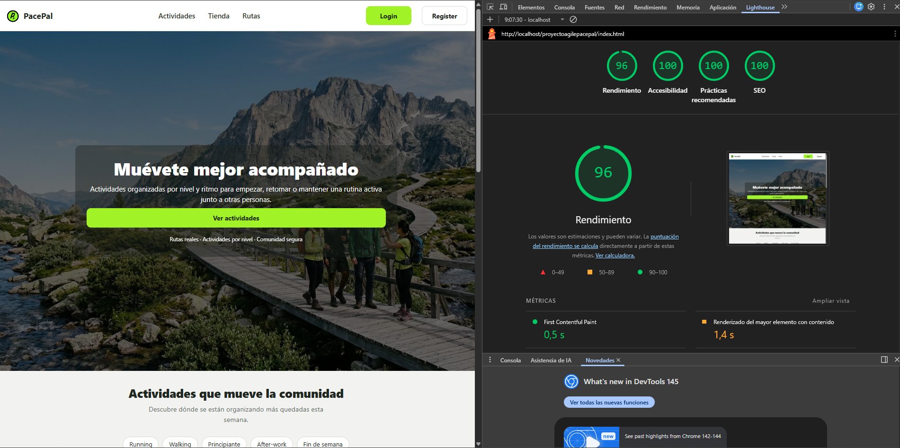
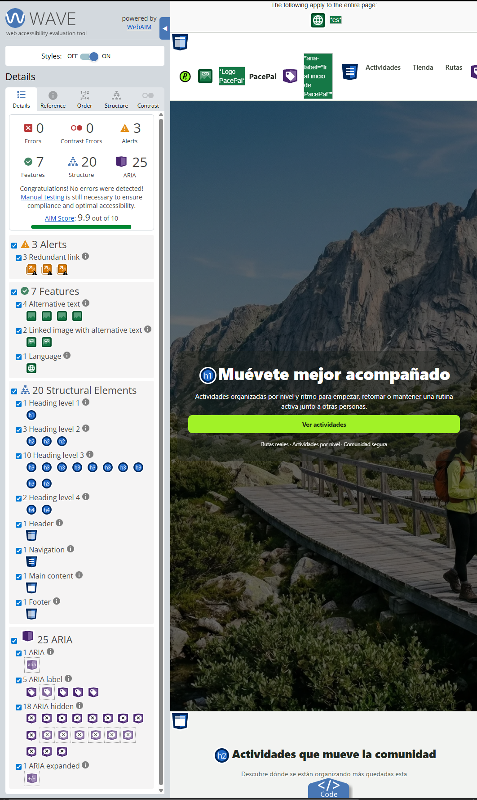
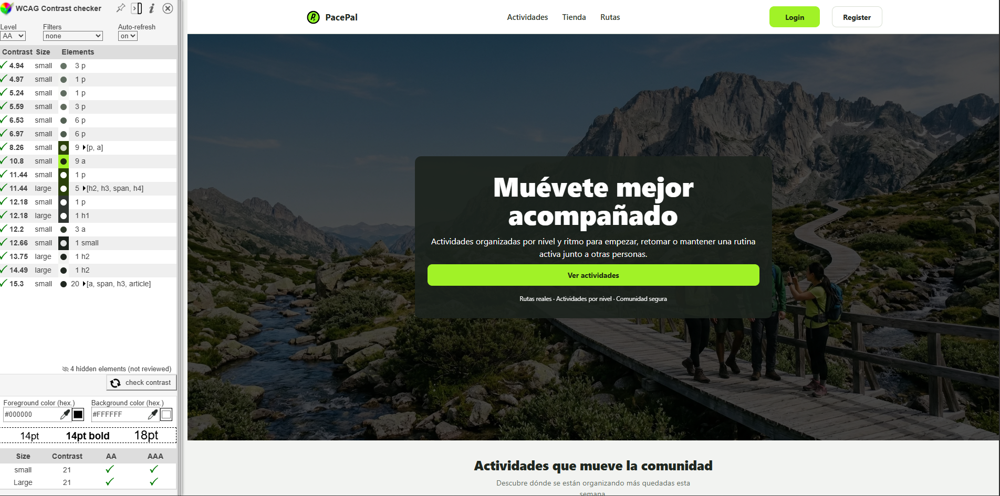

# DI4 · Informe de Accesibilidad WCAG 2.1 (Nivel A)

## 1. Resumen

Este informe describe la conformidad de la web **PacePal** con las directrices de accesibilidad al contenido web. El proceso de evaluación está descrito en la sección 5 y se ha realizado siguiendo el enfoque de revisión combinada (automática y manual) recomendado por W3C/WAI.

Plantilla de referencia consultada:

- WCAG 2.0 Recommendation: `https://www.w3.org/TR/2008/REC-WCAG20-20081211/`

Adaptación aplicada para este proyecto:

- Evaluación enfocada en **WCAG 2.1 Nivel A**
- Alcance limitado a la **landing page (`index.html`)**

Basada en esta evaluación, la landing de **PacePal cumple** el nivel objetivo de conformidad definido para el sprint (WCAG 2.1 Nivel A), con resultados detallados en la sección 6 y recursos en las secciones 7 y 8.

## 2. Antecedentes de la evaluación

La evaluación de conformidad en accesibilidad web requiere combinar:

- herramientas automáticas
- revisión manual por parte del equipo

Fechas de revisión en Sprint 2:

- Revisión técnica y contraste: **marzo 2026**

Nota:

- El sitio puede haber cambiado después de la fecha de revisión.
- Referencia metodológica adicional: `https://www.w3.org/TR/WCAG20-TECHS/`

## 3. Sitio web revisado

- Nombre del sitio: **PacePal**
- Propósito: landing para promover actividades deportivas en comunidad
- URL base del sitio: `index.html` (entorno local de proyecto)
- URLs de muestra representativa revisadas:
  - `index.html`
  - `index.html#actividades`
  - `index.html#tienda`
- Páginas revisadas manualmente (además de herramientas):
  - `index.html`
- URLs excluidas de esta revisión:
  - `src/formulario/login.html`
  - `src/formulario/registro.html`
- Rango de fechas de revisión: **marzo 2026 (Sprint 2)**
- Idioma por defecto del sitio: `es` (`<html lang="es">`)

## 4. Revisor/es

- Equipo revisor: **Equipo PacePal (Sprint 2 - DIW)**
- Organización: **Proyecto académico DAW**
- Contacto: **interno del equipo del proyecto**
- Áreas de revisión aplicadas:
  - semántica HTML
  - navegación por teclado
  - contraste de color
  - validación con herramientas automáticas
- Idioma de revisión: **español**

## 5. Proceso de revisión

Nivel de conformidad verificado:

- **WCAG 2.1 Nivel A** (objetivo de sprint)

Recursos y listas de verificación consultadas:

- Checklist de referencia WCAG 2.0: `https://www.w3.org/TR/2006/WD-WCAG20-20060427/appendixB.html`
- Especificación WCAG 2.0: `https://www.w3.org/TR/2008/REC-WCAG20-20081211/`

Herramientas de evaluación y validación utilizadas:

- Lighthouse (Chrome DevTools)
- WAVE Web Accessibility Evaluation Tool
- WCAG Contrast Checker (extensión)

Descripción de revisiones manuales realizadas:

- Inspección de HTML y CSS de landing (`index.html` + `css/estilos.css`)
- Verificación de estructura semántica (`main`, `section`, `article`)
- Revisión de ARIA cuando el HTML semántico no es suficiente (`aria-label`, `aria-hidden`, `aria-controls`, `aria-expanded`)
- Pruebas de teclado (`TAB`, `SHIFT+TAB`, `ENTER`)
- Verificación y corrección de contraste en texto del hero

- `Tuvimos que ajustar el color del subtitulo del hero porque el contraste no llegaba al 4.5:1, lo corregimos poniendo el fondo mas oscuro.`

## 6. Resultados y acciones recomendadas

Resumen de resultados:

- La landing de PacePal **cumple WCAG 2.1 Nivel A** en el alcance revisado.
- Lighthouse reporta accesibilidad **100**.
- WAVE reporta **0 errores** y **0 errores de contraste**.
- El análisis de contraste final no muestra fallos por debajo de 4.5:1 en texto normal.

Fortalezas detectadas:

- Estructura semántica correcta en la landing
- Navegación por teclado funcional
- Uso de ARIA justificado
- Contraste de textos y botones validado

Prioridades recomendadas (mejora continua):

- Mantener revisión de contraste en cada cambio visual del hero
- Repetir validación automática en cada sprint
- Registrar nuevas evidencias en la carpeta de sprint correspondiente

Resultados detallados:

| Criterio                       | Revisión                          | Resultado |
| ------------------------------ | --------------------------------- | --------- |
| 1.1.1 Texto alternativo        | Imágenes con atributo `alt`       | Cumple    |
| 1.3.1 Información y relaciones | Estructura semántica HTML         | Cumple    |
| 2.1.1 Teclado                  | Uso con `TAB`/`SHIFT+TAB`/`ENTER` | Cumple    |
| 2.4.2 Título de página         | `<title>PacePal</title>`          | Cumple    |
| 3.1.1 Idioma de la página      | `<html lang="es">`                | Cumple    |

Registro de contraste observado:

| Elemento                   | Ratio observado | Estado |
| -------------------------- | --------------- | ------ |
| Texto principal (`p`)      | 4.94:1          | Cumple |
| Subtítulos (`p`)           | 4.97:1          | Cumple |
| Texto pequeño (`small`)    | 12.66:1         | Cumple |
| Título principal (`h1`)    | 12.18:1         | Cumple |
| Botón principal (`a`)      | 10.80:1         | Cumple |
| Texto secundario (`h2/h3`) | >= 11.44:1      | Cumple |

Recomendaciones para seguimiento:

- Mantener checklist WCAG en PRs o revisiones de sprint
- Programar reevaluación de accesibilidad en Sprint 3
- Añadir comprobación adicional con Axe en próximas iteraciones

## 7. Referencias

- WCAG 2.0 Recommendation: `https://www.w3.org/TR/2008/REC-WCAG20-20081211/`
- Techniques and Failures for WCAG 2.0: `https://www.w3.org/TR/WCAG20-TECHS/`
- Checklist WCAG 2.0 (referencia): `https://www.w3.org/TR/2006/WD-WCAG20-20060427/appendixB.html`
- WAVE: `https://wave.webaim.org/`
- Material de accesibilidad del aula virtual (DIW)

## 8. Anexos

Evidencias y capturas de la evaluación:

- `docs/evidencias/diw/sprint-2/lighthouse-accesibilidad.png`
- `docs/evidencias/diw/sprint-2/wave-analisis.png`
- `docs/evidencias/diw/sprint-2/WCAG_Contrast_Checker.png`

Visualización de anexos desde este documento:

