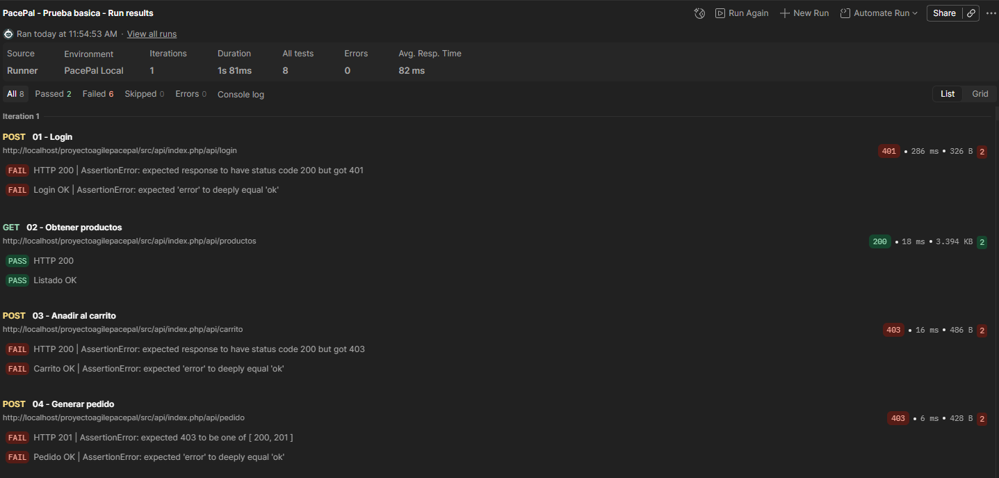
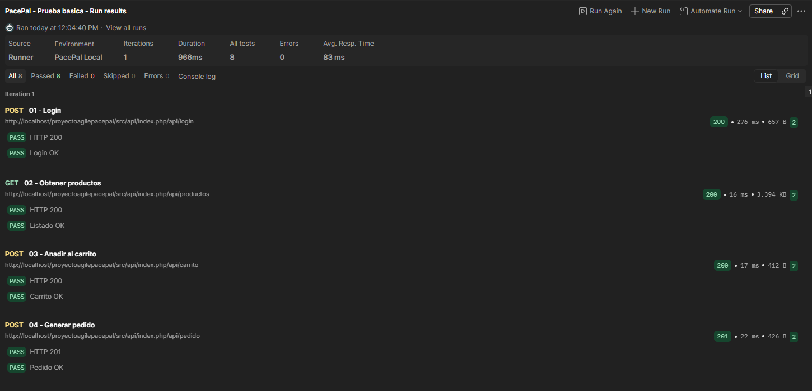

# Pruebas básicas de API con Postman

## 1. Objetivo

Se realizó una validación básica de la API de PacePal con una colección de Postman para comprobar el flujo mínimo:

- inicio de sesión
- obtención de productos
- añadido al carrito
- generación de pedido

## 2. Entorno de prueba

- Herramienta: Postman
- Colección: `PacePal - Prueba basica`
- Environment: `PacePal Local`
- Entorno: local en XAMPP (Apache + MySQL)
- Ejecución: Postman Runner

## 3. Flujo ejecutado

1. `01 - Login`
2. `02 - Obtener productos`
3. `03 - Añadir al carrito`
4. `04 - Generar pedido`

## 4. Resultado de las dos ejecuciones

### 4.1 Primera ejecución (`postman1.png`)

La primera ejecución detectó incidencia de autenticación:

- `01 - Login` devolvió `401 Unauthorized`
- las peticiones protegidas devolvieron `403 Forbidden`

Esta ejecución confirmó que la colección estaba bien cargada y que la incidencia estaba en autenticación/configuración del entorno.

### 4.2 Segunda ejecución (`postman2.png`)

Tras corregir la autenticación/configuración del environment, se repitió la colección completa.

Resultados:

- Login: `200 OK`
- Obtener productos: `200 OK`
- Añadir al carrito: `200 OK`
- Generar pedido: `201 Created`

Con esta segunda ejecución quedó validado el flujo básico.

## 5. Conclusión técnica corta

El flujo básico de la API quedó validado tras corregir la autenticación/configuración del entorno de prueba.

## 6. Evidencias entregadas

- `docs/evidencias/dwes/postman1.png`
- `docs/evidencias/dwes/postman2.png`
- `docs/05-dwes/sprint-2/pruebas-postman.md`
