# 11 — Plan definitivo de anexos visuales y referencias internas — PacePal

> **Fecha:** 2026-05-11  
> **Rama:** `sprint-3-react-jsx`  
> **Propósito:** Planificar el uso de imágenes, diagramas, wireframes y capturas en la memoria final. Determinar qué va al cuerpo principal (solo como referencia clicable) y qué va a los anexos visuales.  
> **Este documento NO inserta imágenes en la memoria.** Solo prepara las referencias y la estructura.

---

## 1. Resumen de criterio

### Principio general

> El cuerpo principal de la memoria debe quedar **limpio, profesional y fácil de leer**.  
> Las figuras, capturas, diagramas, wireframes y evidencias visuales van principalmente al final, organizadas en **Anexos visuales (A a G)**.  
> Desde el texto principal se citan mediante **referencias internas clicables**.

### Reglas de selección de evidencias

| Regla  | Descripción                                                                                                                                                               |
| ------ | ------------------------------------------------------------------------------------------------------------------------------------------------------------------------- |
| **R1** | Si existe una evidencia histórica/manual y una captura nueva sobre el mismo tema, se elige la **más clara, más completa y más defendible**                                |
| **R2** | Por defecto, la evidencia histórica tiene prioridad si es mejor o equivalente                                                                                             |
| **R3** | Las capturas nuevas se usan como principales **solo si** muestran algo que no existía antes, son más claras, más actualizadas o cubren funcionalidad sin evidencia previa |
| **R4** | No duplicar evidencias equivalentes en el cuerpo principal ni en los anexos                                                                                               |
| **R5** | Las capturas descartadas como principales no se borran: quedan clasificadas como "apoyo secundario", "anexo opcional" o "descartada como principal"                       |
| **R6** | No llamar "Postman" a capturas que muestran respuestas JSON en el navegador                                                                                               |
| **R7** | No llamar "Consola DevTools" a capturas que muestran la app cargada en el navegador                                                                                       |
| **R8** | No afirmar que una captura demuestra navegación por voz si no se ve activada                                                                                              |
| **R9** | No afirmar que el audio está demostrado si no aparece `<audio controls>` visible                                                                                          |

### Formato de referencia interna en el cuerpo

```markdown
[Ver Figura A1: Diagrama de Gantt](#fig-a1-diagrama-de-gantt)
```

### Formato de figura en el anexo

```markdown
### Figura A1 — Diagrama de Gantt del proyecto

<a id="fig-a1-diagrama-de-gantt"></a>


**Pie de figura:** Diagrama de Gantt de PacePal organizado por sprints y cierre documental.
```

---

## 2. Figuras citables desde el cuerpo principal

Solo estas figuras se citarán explícitamente en el texto del cuerpo. El resto van únicamente a los anexos sin cita directa en el texto principal.

| ID fig. | Título de la figura                            | Archivo elegido                       | Ruta real                                                                   | Apartado del cuerpo            | Referencia clicable recomendada                                                 | Ancla                              | Motivo de selección                                                                                                                                  | Evidencia descartada equivalente                        |
| ------- | ---------------------------------------------- | ------------------------------------- | --------------------------------------------------------------------------- | ------------------------------ | ------------------------------------------------------------------------------- | ---------------------------------- | ---------------------------------------------------------------------------------------------------------------------------------------------------- | ------------------------------------------------------- |
| **A1**  | Diagrama de Gantt del proyecto                 | Diagrama de Gantt.png                 | `docs/documentacion-final/figuras/Diagrama de Gantt.png`                    | §3.1 Planificación             | `[Ver Figura A1: Diagrama de Gantt](#fig-a1-diagrama-de-gantt)`                 | `fig-a1-diagrama-de-gantt`         | Único diagrama de Gantt PNG disponible                                                                                                               | —                                                       |
| **A2**  | Diagrama de casos de uso                       | Diagrama de casos de uso.png          | `docs/documentacion-final/figuras/Diagrama de casos de uso.png`             | §4.1 Requisitos                | `[Ver Figura A2: Diagrama de casos de uso](#fig-a2-casos-de-uso)`               | `fig-a2-casos-de-uso`              | Único, Draw.io definitivo                                                                                                                            | —                                                       |
| **B1**  | Diagrama de componentes React                  | Diagrama de componentes.png           | `docs/documentacion-final/figuras/Diagrama de componentes.png`              | §4.2 Análisis / Arquitectura   | `[Ver Figura B1: Diagrama de componentes](#fig-b1-componentes)`                 | `fig-b1-componentes`               | Único, Draw.io definitivo                                                                                                                            | —                                                       |
| **B2**  | Esquema de arquitectura general                | Esquema de arquitectura general.png   | `docs/documentacion-final/figuras/Esquema de arquitectura general.png`      | §4.2 Análisis / Arquitectura   | `[Ver Figura B2: Arquitectura general](#fig-b2-arquitectura)`                   | `fig-b2-arquitectura`              | Más representativa del stack completo                                                                                                                | —                                                       |
| **B3**  | Modelo relacional simplificado                 | Modelo relacional simplificado.png    | `docs/documentacion-final/figuras/Modelo relacional simplificado.png`       | §4.1 Modelo de datos / §9 DWES | `[Ver Figura B3: Modelo relacional](#fig-b3-modelo-relacional)`                 | `fig-b3-modelo-relacional`         | Draw.io definitivo; más limpio que ER histórico                                                                                                      | `evidencias/dwes/diagramaER.png` (irá al anexo como B4) |
| **C1**  | Logotipo de PacePal                            | logo.png                              | `docs/03-diw/media/logo.png`                                                | Portada / §4.3 Diseño          | `[Ver Figura C1: Logotipo](#fig-c1-logo)`                                       | `fig-c1-logo`                      | Único logotipo oficial                                                                                                                               | —                                                       |
| **C2**  | Paleta de color corporativa                    | paletaIdentidadVisual.png             | `docs/03-diw/media/paletaIdentidadVisual.png`                               | §4.3 Diseño / Identidad visual | `[Ver Figura C2: Paleta de color](#fig-c2-paleta)`                              | `fig-c2-paleta`                    | Versión completa con nombre de colores; más informativa que `paleta.png`                                                                             | `docs/03-diw/media/paleta.png` (descartada)             |
| **C5**  | Wireframe landing — escritorio                 | wireframe-landing-desktop.png         | `docs/03-diw/wireframes/wireframe-landing-desktop.png`                      | §4.3 Diseño                    | `[Ver Figura C5: Wireframe landing desktop](#fig-c5-wireframe-landing-desktop)` | `fig-c5-wireframe-landing-desktop` | Página principal — más representativa del proyecto                                                                                                   | —                                                       |
| **C6**  | Wireframe landing — móvil                      | wireframe-landing-mobile.png          | `docs/03-diw/wireframes/wireframe-landing-mobile.png`                       | §4.3 Diseño / Responsive       | `[Ver Figura C6: Wireframe landing mobile](#fig-c6-wireframe-landing-mobile)`   | `fig-c6-wireframe-landing-mobile`  | Demuestra diseño responsive planificado                                                                                                              | —                                                       |
| **C8**  | Esquema responsive modular                     | Esquema responsive modular.png        | `docs/documentacion-final/figuras/Esquema responsive modular.png`           | §4.3 Diseño / Responsive       | `[Ver Figura C8: Responsive modular](#fig-c8-responsive-modular)`               | `fig-c8-responsive-modular`        | Explica el sistema CSS modular; ninguna otra figura cubre esto                                                                                       | —                                                       |
| **D4**  | Carrito React con producto y total             | Carrito-React.png                     | `docs/evidencias/dwec/sprint-3/Carrito-React.png`                           | §5.1 Pruebas / DWEC            | `[Ver Figura D4: Carrito React con producto](#fig-d4-carrito)`                  | `fig-d4-carrito`                   | **ÚNICA** captura que muestra el carrito funcionando con producto real, precio y total. Las nuevas mostraron estado erróneo (CORS / sesión caducada) | CF-09, CF-11 (descartadas)                              |
| **D5**  | Confirmación añadir al carrito                 | Carrito_añadir_React.png              | `docs/evidencias/dwec/sprint-3/Carrito_añadir_React.png`                    | §5.1 Pruebas / DWEC            | `[Ver Figura D5: Añadir al carrito](#fig-d5-anadir-carrito)`                    | `fig-d5-anadir-carrito`            | **ÚNICA** evidencia del mensaje de confirmación de añadir                                                                                            | — (sin equivalente nuevo)                               |
| **D7**  | Flujo de autenticación — login, sesión, logout | Flujo loginSesionLogOut.png           | `docs/documentacion-final/figuras/Flujo loginSesionLogOut.png`              | §5.1 Pruebas / Auth            | `[Ver Figura D7: Flujo de autenticación](#fig-d7-flujo-auth)`                   | `fig-d7-flujo-auth`                | Diagrama que explica el flujo completo. Las capturas individuales van al Anexo D                                                                     | —                                                       |
| **F1**  | Resultado Lighthouse — accesibilidad 100       | lighthouse-accesibilidad.png          | `docs/evidencias/diw/sprint-2/lighthouse-accesibilidad.png`                 | §5.2 Accesibilidad             | `[Ver Figura F1: Lighthouse accesibilidad](#fig-f1-lighthouse)`                 | `fig-f1-lighthouse`                | Puntuación 100 — evidencia más sólida y defendible del proyecto. Sin equivalente nuevo                                                               | CF-24 (mal clasificada)                                 |
| **G1**  | Panel XAMPP activo en localhost                | 01-xampp-dashboard-localhost.png      | `docs/evidencias/despliegue/sprint-3/01-xampp-dashboard-localhost.png`      | §5.1 Despliegue                | `[Ver Figura G1: XAMPP activo](#fig-g1-xampp)`                                  | `fig-g1-xampp`                     | Inasequible por navegador automatizado. Solo existe como captura manual. Única evidencia del entorno local                                           | —                                                       |
| **G3**  | GitHub Pages publicado con HTTPS               | 08-github-pages-publicacion-https.png | `docs/evidencias/despliegue/sprint-3/08-github-pages-publicacion-https.png` | §5.1 Despliegue                | `[Ver Figura G3: GitHub Pages HTTPS](#fig-g3-github-pages)`                     | `fig-g3-github-pages`              | Única evidencia del despliegue externo con HTTPS                                                                                                     | —                                                       |

**Total de figuras citadas desde el cuerpo principal: 15**

---

## 3. Imágenes que van solo a los anexos (sin cita directa en el cuerpo)

Estas imágenes existen, son válidas, pero su cita desde el cuerpo principal añadiría ruido sin valor relevante. Se incluyen solo en el Anexo correspondiente.

| ID            | Archivo                                 | Ruta                                                               | Anexo                    | Qué demuestra                                | Por qué no va en el cuerpo principal                                                |
| ------------- | --------------------------------------- | ------------------------------------------------------------------ | ------------------------ | -------------------------------------------- | ----------------------------------------------------------------------------------- |
| A3            | Diagrama de clases simplificado.png     | `figuras/Diagrama de clases simplificado.png`                      | Anexo A                  | Entidades del dominio                        | El texto lo describe suficientemente; el diagrama es complementario                 |
| B4            | diagramaER.png                          | `evidencias/dwes/diagramaER.png`                                   | Anexo B                  | Diagrama ER histórico más detallado          | El nuevo modelo relacional (B3) ya cubre esto en el cuerpo                          |
| C3            | tipografiaIdentidadVisual.png           | `docs/03-diw/media/tipografiaIdentidadVisual.png`                  | Anexo C                  | Tipografías corporativas                     | Detalle de diseño que va en guía de estilos, no en cuerpo técnico                   |
| C4            | pacepal_iconografia.png                 | `docs/03-diw/media/pacepal_iconografia.png`                        | Anexo C                  | Sistema de iconografía                       | Idem — guía de estilos, no cuerpo técnico                                           |
| C7            | wireframe-tienda-desktop.png            | `docs/03-diw/wireframes/wireframe-tienda-desktop.png`              | Anexo C                  | Wireframe tienda desktop                     | Adicional al par landing desktop/mobile ya citados                                  |
| C9a           | responsive-desktop-landing.png          | `capturas-finales/03-responsive/responsive-desktop-landing.png`    | Anexo C                  | Responsive desktop real                      | Los wireframes en el cuerpo explican el diseño; las capturas reales refuerzan       |
| C9b           | responsive-tablet-landing.png           | `capturas-finales/03-responsive/responsive-tablet-landing.png`     | Anexo C                  | Responsive tablet real                       | Idem                                                                                |
| C9c           | responsive-mobile-landing.png           | `capturas-finales/03-responsive/responsive-mobile-landing.png`     | Anexo C                  | Responsive mobile real                       | Idem                                                                                |
| D1            | productos-buscador.png                  | `evidencias/dwec/sprint-3/productos-buscador.png`                  | Anexo D                  | Tienda con buscador activo, usuario logueado | Las figuras de flujo (D7-D9) son suficientes en el cuerpo                           |
| D2            | Buscador_sin_resultados.png             | `evidencias/dwec/sprint-3/Buscador_sin_resultados.png`             | Anexo D                  | Buscador sin resultados                      | Complementario a D1                                                                 |
| D3            | react-detalle-producto.png              | `capturas-finales/02-react/react-detalle-producto.png`             | Anexo D                  | Detalle de producto React                    | Única captura de este estado, pero el cuerpo la puede citar opcionalmente           |
| D6            | react-login.png                         | `capturas-finales/02-react/react-login.png`                        | Anexo D                  | Formulario login React                       | Las capturas sprint-1 del flujo de login son más representativas del flujo completo |
| D8            | react-perfil-usuario.png                | `capturas-finales/02-react/react-perfil-usuario.png`               | Anexo D                  | Perfil admin con historial de pedidos        | Complementa las capturas históricas de perfil                                       |
| D9a           | react-panel-admin.png                   | `capturas-finales/02-react/react-panel-admin.png`                  | Anexo D                  | Panel de administración                      | Complementa DWEC-S3-07                                                              |
| D9b           | Nuevos-usuarios.png                     | `evidencias/dwec/sprint-3/Nuevos-usuarios.png`                     | Anexo D                  | Panel admin con datos de usuarios            | Datos reales del panel admin                                                        |
| E1            | api-get-productos-raw.png               | `capturas-finales/06-postman/api-get-productos-raw.png`            | Anexo E                  | API directa desde navegador — GET productos  | Evidencia de API funcional; en el cuerpo el texto la menciona                       |
| E2            | api-get-health.png                      | `capturas-finales/06-postman/api-get-health.png`                   | Anexo E                  | API health endpoint                          | Complementario                                                                      |
| E3            | api-get-session.png                     | `capturas-finales/06-postman/api-get-session.png`                  | Anexo E                  | Sesión admin activa                          | Complementario                                                                      |
| E4            | postman1.png                            | `evidencias/dwes/postman1.png`                                     | Anexo E                  | Postman real — runner con resultados         | Citable opcionalmente desde el cuerpo en §9 Pruebas                                 |
| E5            | postman2.png                            | `evidencias/dwes/postman2.png`                                     | Anexo E                  | Postman real — segunda ejecución             | Complementa E4                                                                      |
| E6            | 03-phpmyadmin-bd-pacepal.png            | `evidencias/despliegue/sprint-3/03-phpmyadmin-bd-pacepal.png`      | Anexo E                  | phpMyAdmin con BD pacepal y tablas           | Complementa G1 en el tema de despliegue                                             |
| F2            | wave-analisis.png                       | `evidencias/diw/sprint-2/wave-analisis.png`                        | Anexo F                  | WAVE — análisis de accesibilidad             | Complementa F1 (Lighthouse) que sí va en el cuerpo                                  |
| F3            | WCAG_Contrast_Checker.png               | `evidencias/diw/sprint-2/WCAG_Contrast_Checker.png`                | Anexo F                  | Contraste WCAG                               | Detalle de accesibilidad                                                            |
| F4            | accesibilidad-foco-teclado.png          | `capturas-finales/05-accesibilidad/accesibilidad-foco-teclado.png` | Anexo F                  | Foco visible por teclado (Tab)               | Evidencia válida; el cuerpo puede mencionarla o solo listarla en el anexo           |
| F5            | multimedia-video-tienda.png             | `capturas-finales/04-multimedia/multimedia-video-tienda.png`       | Anexo F                  | Vídeo integrado con controles visibles       | El cuerpo puede referenciarla opcionalmente                                         |
| G2            | despliegue-app-localhost.png            | `capturas-finales/01-despliegue/despliegue-app-localhost.png`      | Anexo G                  | App en localhost (captura nueva)             | G1 (XAMPP) ya es la cita principal de despliegue                                    |
| HIST-01/02    | sprint0-arbol.png / sprint0-tablero.png | `evidencias/01-sprint0/`                                           | Anexo A (opcional)       | Contexto sprint 0                            | Valor histórico; no imprescindible en cuerpo                                        |
| SOST-01/03    | pacepalA3.png, postales                 | `docs/07-sostenibilidad/concurso/`                                 | Anexo G (sostenibilidad) | Material concurso sostenibilidad             | Solo para anexo de sostenibilidad, no cuerpo técnico                                |
| WF-03 a WF-18 | wireframe-\*.png (15 wireframes)        | `docs/03-diw/wireframes/`                                          | Anexo C                  | Wireframes restantes                         | Solo landing desktop+mobile van al cuerpo. El resto al anexo de diseño              |

---

## 4. Tabla comparativa: evidencias históricas elegidas frente a capturas nuevas

### 4.1 Carrito React

| Criterio         | Histórica `Carrito-React.png`                                                   | Nueva `react-carrito-con-producto.png`               | Nueva `react-carrito-total.png`                  |
| ---------------- | ------------------------------------------------------------------------------- | ---------------------------------------------------- | ------------------------------------------------ |
| Contenido        | Carrito con Camiseta deportiva, qty 4, total 119,60 EUR, botón Finalizar pedido | Tienda con botón "Error" en primer producto          | "Tu carrito está vacío" + "Acceso no autorizado" |
| Estado funcional | ✅ Correcto                                                                     | ❌ Error CORS 403                                    | ❌ Sesión caducada                               |
| **Decisión**     | **PRINCIPAL** (única evidencia válida del carrito)                              | **Descartada como principal**                        | **Descartada como principal**                    |
| Motivo           | Solo la histórica demuestra el carrito funcionando con producto, precio y total | El testing automatizado no pudo mantener sesión CORS | Ídem                                             |

### 4.2 Añadir al carrito

| Criterio     | Histórica `Carrito_añadir_React.png`                  | Nueva equivalente                   |
| ------------ | ----------------------------------------------------- | ----------------------------------- |
| Contenido    | Mensaje de confirmación "Añadido al carrito." visible | No existe captura nueva equivalente |
| **Decisión** | **PRINCIPAL — sin alternativa nueva**                 | —                                   |

### 4.3 Buscador con resultados

| Criterio           | Histórica `productos-buscador.png`                | Nueva `react-buscador-resultados.png` |
| ------------------ | ------------------------------------------------- | ------------------------------------- |
| Término buscado    | "zapatillas"                                      | "zapatillas"                          |
| Estado de login    | ✅ Usuario logueado                               | ❌ No logueado                        |
| Contexto de tienda | Completo — buscador y grid de productos           | Completo                              |
| **Decisión**       | **PRINCIPAL**                                     | Apoyo secundario                      |
| Motivo             | Usuario logueado, estado más natural y defendible | —                                     |

### 4.4 Buscador sin resultados

| Criterio     | Histórica `Buscador_sin_resultados.png` | Nueva `react-buscador-sin-resultados.png` | Histórica `productos-no-encontrado.png` |
| ------------ | --------------------------------------- | ----------------------------------------- | --------------------------------------- |
| Login        | ✅ Logueado                             | ❌ No logueado                            | No determinado                          |
| Encuadre     | Limpio, centrado                        | Incluye sección de vídeo                  | —                                       |
| **Decisión** | **PRINCIPAL**                           | Apoyo secundario                          | Apoyo secundario                        |

### 4.5 phpMyAdmin — BD pacepal

| Criterio        | Histórica `03-phpmyadmin-bd-pacepal.png` | Nueva `despliegue-phpmyadmin-bbdd-pacepal.png` |
| --------------- | ---------------------------------------- | ---------------------------------------------- |
| Sidebar         | ✅ Solo BD del proyecto                  | ❌ Expone otras BDs del sistema                |
| Tablas visibles | 9 tablas, 5 usuarios, 38 filas           | 9 tablas, 2 usuarios                           |
| Profesionalidad | Alta — no expone entorno personal        | Baja — expone otros proyectos                  |
| **Decisión**    | **PRINCIPAL**                            | Descartada como principal                      |

### 4.6 Postman real

| Criterio               | Históricas `postman1.png` / `postman2.png` | Nuevas `capturas-finales/06-postman/api-get-*.png`  |
| ---------------------- | ------------------------------------------ | --------------------------------------------------- |
| Herramienta real       | ✅ Postman Runner con resultados           | ❌ Respuesta JSON en navegador (no Postman)         |
| Clasificación correcta | **Evidencia Postman**                      | **API directa desde navegador**                     |
| **Decisión**           | **PRINCIPAL para sección Postman**         | Válidas para sección API REST, NO llamarlas Postman |

### 4.7 Lighthouse / accesibilidad

| Criterio         | Histórica `lighthouse-accesibilidad.png`                          | Nuevas `capturas-finales/05-accesibilidad/`                                                 |
| ---------------- | ----------------------------------------------------------------- | ------------------------------------------------------------------------------------------- |
| Contenido        | Puntuación Lighthouse: Accesibilidad 100, SEO 100, Rendimiento 96 | `accesibilidad-boton-voz.png` (mal clasificada) + `accesibilidad-foco-teclado.png` (válida) |
| Valor de defensa | Muy alto — puntuación objetiva 100                                | `accesibilidad-foco-teclado.png` válida para foco teclado                                   |
| **Decisión**     | **PRINCIPAL ABSOLUTA para accesibilidad**                         | Solo `accesibilidad-foco-teclado.png` es válida (para foco teclado)                         |

### 4.8 Perfil de usuario

| Criterio          | Histórica `Perfil-React.png`                                            | Nueva `react-perfil-usuario.png`                          |
| ----------------- | ----------------------------------------------------------------------- | --------------------------------------------------------- |
| Usuario           | Regular — Alejandro Pacheco                                             | Admin — admin@pacepal.com                                 |
| Historial pedidos | No visible                                                              | ✅ Visible — confirma carrito real                        |
| Datos sensibles   | Nombre real, DNI de test                                                | Email genérico                                            |
| **Decisión**      | Apoyo secundario                                                        | **PRINCIPAL** (mejor porque confirma carrito funcionando) |
| Motivo            | La nueva aporta algo que la histórica no tiene: el historial de pedidos | —                                                         |

### 4.9 Panel admin

| Criterio          | Histórica `Nuevos-usuarios.png`            | Nueva `react-panel-admin.png` |
| ----------------- | ------------------------------------------ | ----------------------------- |
| Contenido         | Datos de usuarios reales en panel          | Interfaz del panel admin      |
| Complementariedad | Muestra datos dentro del panel             | Muestra la UI del panel       |
| **Decisión**      | **Ambas al Anexo D — son complementarias** | —                             |

### 4.10 Despliegue local — App en localhost

| Criterio     | Histórica `04-app-localhost-home.png` | Nueva `despliegue-app-localhost.png`       |
| ------------ | ------------------------------------- | ------------------------------------------ |
| **Decisión** | Apoyo secundario                      | **PRINCIPAL** — más reciente, estado final |

### 4.11 Responsive real

| Criterio          | Nuevas capturas `03-responsive/`                                              | Wireframes históricos `03-diw/wireframes/`           |
| ----------------- | ----------------------------------------------------------------------------- | ---------------------------------------------------- |
| Qué demuestran    | Implementación real en viewports reales                                       | Diseño planificado                                   |
| Complementariedad | Son distintos tipos de evidencia                                              | —                                                    |
| **Decisión**      | **Capturas reales al Anexo C** para evidencia funcional                       | **Wireframes al cuerpo (2)** + Anexo C para el resto |
| Nota              | `responsive-mobile-tienda.png` tiene posible overflow — revisar antes de usar | —                                                    |

### 4.12 Vídeo integrado

| Criterio     | Nueva `multimedia-video-tienda.png`              | Equivalente histórico           |
| ------------ | ------------------------------------------------ | ------------------------------- |
| Contenido    | `<video controls>` con barra 0:00/0:08 visible   | No existe equivalente histórico |
| **Decisión** | **PRINCIPAL** — única evidencia válida del vídeo | —                               |

### 4.13 Audio

| Criterio     | Nueva `multimedia-audio-contacto.png`                   | Equivalente histórico |
| ------------ | ------------------------------------------------------- | --------------------- |
| Contenido    | Formulario de contacto — sin `<audio controls>` visible | No existe             |
| **Decisión** | **Descartada como evidencia de audio**                  | **Pendiente manual**  |

### 4.14 Foco por teclado / voz

| Criterio     | Nueva `accesibilidad-foco-teclado.png` | Nueva `accesibilidad-boton-voz.png`   |
| ------------ | -------------------------------------- | ------------------------------------- |
| Foco teclado | ✅ Foco visible (outline Tab)          | ❌ No muestra botón de voz            |
| Botón voz    | —                                      | ❌ Muestra landing con admin logueado |
| **Decisión** | **Válida — Anexo F**                   | **Descartada como evidencia de voz**  |

---

## 5. Capturas nuevas que sí se conservan (aportan algo nuevo)

| Captura nueva                    | Ruta                                                               | Por qué aporta valor único                                                                                     |
| -------------------------------- | ------------------------------------------------------------------ | -------------------------------------------------------------------------------------------------------------- |
| `react-detalle-producto.png`     | `capturas-finales/02-react/react-detalle-producto.png`             | Única captura existente del detalle de producto en React                                                       |
| `multimedia-video-tienda.png`    | `capturas-finales/04-multimedia/multimedia-video-tienda.png`       | Única evidencia visual del `<video controls>` integrado en la tienda                                           |
| `react-perfil-usuario.png`       | `capturas-finales/02-react/react-perfil-usuario.png`               | Muestra historial de pedidos — confirma que el carrito funcionó en sesiones reales. La histórica no tiene esto |
| `react-login.png`                | `capturas-finales/02-react/react-login.png`                        | Captura limpia del formulario login en React (versión final del sprint 3)                                      |
| `react-panel-admin.png`          | `capturas-finales/02-react/react-panel-admin.png`                  | Captura del panel admin en la versión React final                                                              |
| `accesibilidad-foco-teclado.png` | `capturas-finales/05-accesibilidad/accesibilidad-foco-teclado.png` | Foco visible por teclado — no existe equivalente histórico manual                                              |
| `responsive-desktop-landing.png` | `capturas-finales/03-responsive/responsive-desktop-landing.png`    | Captura real en 1280×900 — demuestra responsive funcional (no solo planificado)                                |
| `responsive-tablet-landing.png`  | `capturas-finales/03-responsive/responsive-tablet-landing.png`     | Captura real en 768×1024 — demuestra responsive tablet funcional                                               |
| `responsive-mobile-landing.png`  | `capturas-finales/03-responsive/responsive-mobile-landing.png`     | Captura real en 390×844 — demuestra responsive mobile                                                          |
| `api-get-productos-raw.png`      | `capturas-finales/06-postman/api-get-productos-raw.png`            | Respuesta JSON real de la API en el navegador — evidencia de API funcional                                     |
| `api-get-health.png`             | `capturas-finales/06-postman/api-get-health.png`                   | Health endpoint confirmado visualmente                                                                         |
| `api-get-session.png`            | `capturas-finales/06-postman/api-get-session.png`                  | Sesión admin activa confirmada visualmente                                                                     |
| `react-landing-desktop.png`      | `capturas-finales/02-react/react-landing-desktop.png`              | Landing en estado final con admin logueado — bien encuadrada                                                   |
| Los 10 PNG de `figuras/`         | `docs/documentacion-final/figuras/`                                | Diagramas Draw.io definitivos — sustituyen todos los archivos `.mmd` anteriores                                |

---

## 6. Capturas descartadas como principales

Estas capturas se conservan en el repositorio pero NO deben usarse como evidencias principales.

| Archivo                                  | Ruta                                 | Motivo de descarte                                                                       | Evidencia recomendada en su lugar                             |
| ---------------------------------------- | ------------------------------------ | ---------------------------------------------------------------------------------------- | ------------------------------------------------------------- |
| `react-carrito-con-producto.png`         | `capturas-finales/02-react/`         | Muestra botón "Error" (CORS 403) — no demuestra carrito funcionando                      | `evidencias/dwec/sprint-3/Carrito-React.png`                  |
| `react-carrito-total.png`                | `capturas-finales/02-react/`         | Muestra "Tu carrito está vacío" + "Acceso no autorizado" (sesión caducada)               | `evidencias/dwec/sprint-3/Carrito-React.png`                  |
| `despliegue-phpmyadmin-bbdd-pacepal.png` | `capturas-finales/01-despliegue/`    | Sidebar expone otras BDs del sistema (otros proyectos XAMPP)                             | `evidencias/despliegue/sprint-3/03-phpmyadmin-bd-pacepal.png` |
| `accesibilidad-boton-voz.png`            | `capturas-finales/05-accesibilidad/` | Muestra landing page con admin logueado — NO hay botón de voz visible. Nombre incorrecto | Pendiente captura manual real del botón de voz                |
| `multimedia-audio-contacto.png`          | `capturas-finales/04-multimedia/`    | No muestra `<audio controls>` visible — solo el formulario de contacto                   | Pendiente captura manual donde el audio sea visible           |
| `consola-app-inicio-sin-errores.png`     | `capturas-finales/07-consola/`       | NO muestra DevTools Console. Nombre incorrecto. Muestra landing con admin logueado       | Para "consola real": pendiente DevTools manual                |
| `api-get-productos.png`                  | `capturas-finales/07-consola/`       | Ruta no encontrada inicialmente — resultado incierto                                     | `capturas-finales/06-postman/api-get-productos-raw.png`       |
| `api-respuesta-get-productos.png`        | `capturas-finales/07-consola/`       | Similar al anterior — resultado incierto                                                 | `capturas-finales/06-postman/api-get-productos-raw.png`       |
| `react-buscador-sin-resultados.png`      | `capturas-finales/02-react/`         | Válida pero inferior: usuario no logueado, incluye sección de vídeo que distrae          | `evidencias/dwec/sprint-3/Buscador_sin_resultados.png`        |
| `react-carrito-contador.png`             | `capturas-finales/02-react/`         | Solo muestra el header — no demuestra carrito con producto                               | `evidencias/dwec/sprint-3/Carrito-React.png`                  |
| `docs/03-diw/media/paleta.png`           | `docs/03-diw/media/`                 | Versión simplificada sin nombres de colores                                              | `docs/03-diw/media/paletaIdentidadVisual.png`                 |

---

## 7. Pendientes manuales reales

| #     | Evidencia                             | Descripción                                                                                               | Cómo capturarla                                             | Prioridad | Obligatoria                                  |
| ----- | ------------------------------------- | --------------------------------------------------------------------------------------------------------- | ----------------------------------------------------------- | --------- | -------------------------------------------- |
| PM-01 | DevTools Console                      | Chrome F12 > Console con la app cargada — sin errores críticos                                            | Abrir Chrome, cargar app, F12 > Console > screenshot        | Alta      | Recomendable                                 |
| PM-02 | DevTools Network                      | Chrome F12 > Network > cargar tienda > click en GET /api/productos > ver respuesta JSON 200               | Chrome DevTools > Network > Fetch/XHR                       | Alta      | Recomendable                                 |
| PM-03 | Postman POST /api/login               | Usar colección `tests/postman/pacepal.postman_collection.json` con Postman — login correcto (200+sesión)  | Importar colección, ejecutar POST login                     | Alta      | Recomendable                                 |
| PM-04 | Audio `<audio controls>`              | Localizar en qué página/sección aparece el reproductor de audio y hacer screenshot con controles visibles | Abrir `pages/formulario/ContactPage.jsx` y cargar la página | Media     | Recomendable si audio integrado existe en UI |
| PM-05 | Botón de accesibilidad por voz        | Localizar el botón real en la interfaz (posiblemente esquina inferior) y hacer screenshot                 | Abrir app, buscar el botón de accesibilidad en UI           | Media     | Recomendable                                 |
| PM-06 | Responsive mobile tienda sin overflow | Verificar `responsive-mobile-tienda.png` — si hay overflow horizontal real, repetir captura               | Chrome DevTools > Device Mode > 390px > abrir tienda        | Media     | Solo si hay overflow real                    |
| PM-07 | Postman POST /api/carrito             | Requiere sesión activa — usar Postman con cookie de sesión válida                                         | Postman con autenticación previa (login) + POST carrito     | Baja      | Opcional                                     |

---

## 8. Estructura propuesta de anexos visuales

La memoria final debe organizar los recursos visuales en esta estructura de Anexos al final del documento. Cada figura tiene un identificador, ancla HTML y pie de figura.

> **Instrucción de maquetación:** Insertar el bloque de Anexos A-G al final de la memoria, después de la bibliografía. Cada `<a id="...">` permite el salto desde la referencia clicable en el cuerpo principal.

---

### Anexo A — Planificación y análisis

```markdown
## Anexo A — Planificación y análisis

### Figura A1 — Diagrama de Gantt del proyecto

<a id="fig-a1-diagrama-de-gantt"></a>

**Pie:** Diagrama de Gantt de PacePal organizado por sprints y cierre documental. Elaborado con Draw.io.

### Figura A2 — Diagrama de casos de uso

<a id="fig-a2-casos-de-uso"></a>

**Pie:** Actores principales (Visitante, Usuario, Administrador) y sus casos de uso en PacePal.

### Figura A3 — Diagrama de clases simplificado

<a id="fig-a3-clases"></a>

**Pie:** Entidades del dominio y sus relaciones en el backend de PacePal.
```

---

### Anexo B — Arquitectura y base de datos

```markdown
## Anexo B — Arquitectura y base de datos

### Figura B1 — Diagrama de componentes React

<a id="fig-b1-componentes"></a>

**Pie:** Jerarquía de componentes React del cliente de PacePal.

### Figura B2 — Esquema de arquitectura general

<a id="fig-b2-arquitectura"></a>

**Pie:** Stack tecnológico de PacePal: React + Vite (cliente), PHP + PDO (API), MySQL (BD), XAMPP (servidor).

### Figura B3 — Modelo relacional simplificado

<a id="fig-b3-modelo-relacional"></a>

**Pie:** Modelo relacional de la base de datos PacePal. Tablas, claves primarias y relaciones principales.

### Figura B4 — Diagrama entidad-relación (histórico)

<a id="fig-b4-er"></a>
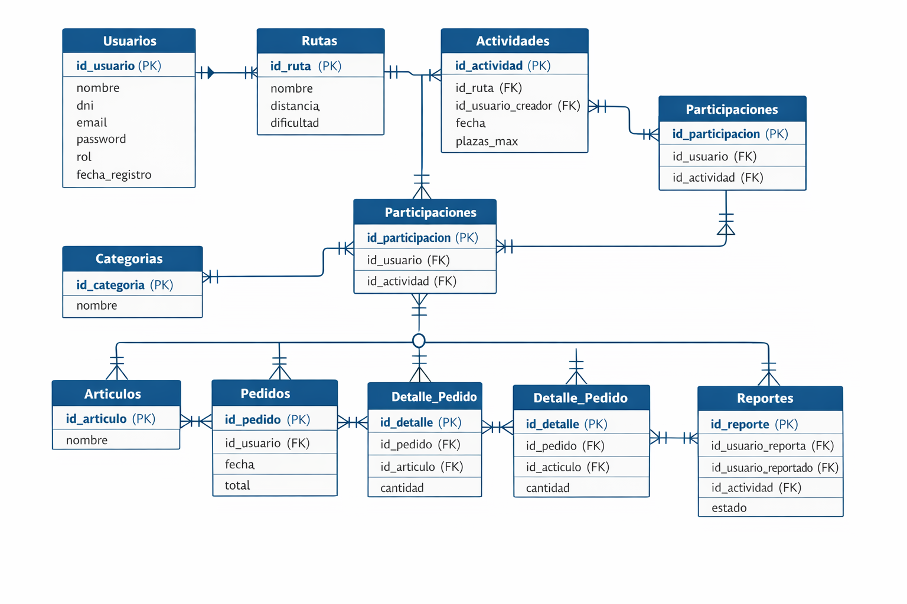
**Pie:** Diagrama entidad-relación elaborado durante el sprint de backend. Versión más detallada del modelo de datos.
```

---

### Anexo C — Diseño, identidad visual y responsive

```markdown
## Anexo C — Diseño, identidad visual y responsive

### Figura C1 — Logotipo de PacePal

<a id="fig-c1-logo"></a>

**Pie:** Logotipo principal de PacePal. Identidad visual del proyecto.

### Figura C2 — Paleta de color corporativa

<a id="fig-c2-paleta"></a>

**Pie:** Paleta principal de colores de PacePal con códigos HEX y aplicación en interfaz.

### Figura C3 — Tipografía corporativa

<a id="fig-c3-tipografia"></a>
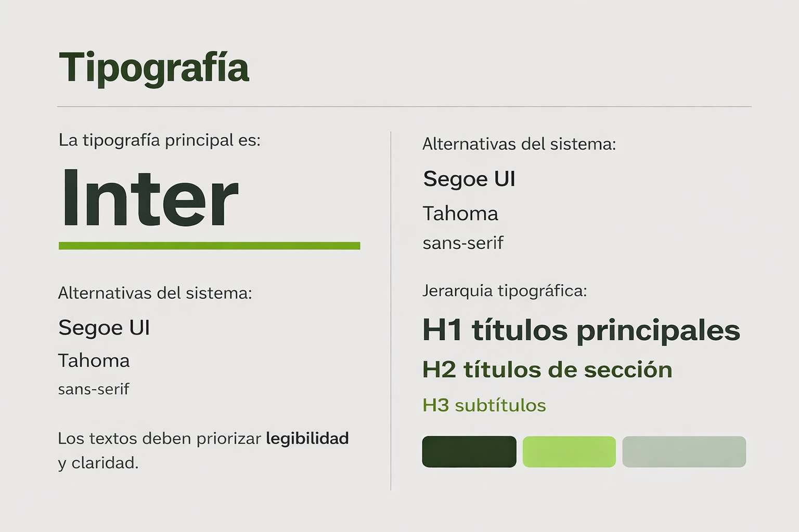
**Pie:** Sistema tipográfico empleado en la identidad visual de PacePal.

### Figura C4 — Iconografía

<a id="fig-c4-iconografia"></a>
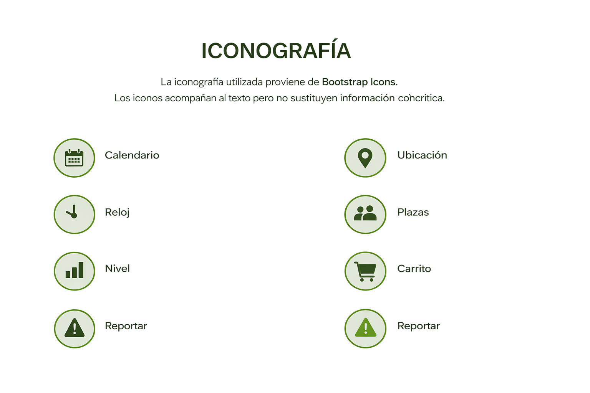
**Pie:** Sistema de iconos de PacePal.

### Figura C5 — Wireframe landing — escritorio

<a id="fig-c5-wireframe-landing-desktop"></a>
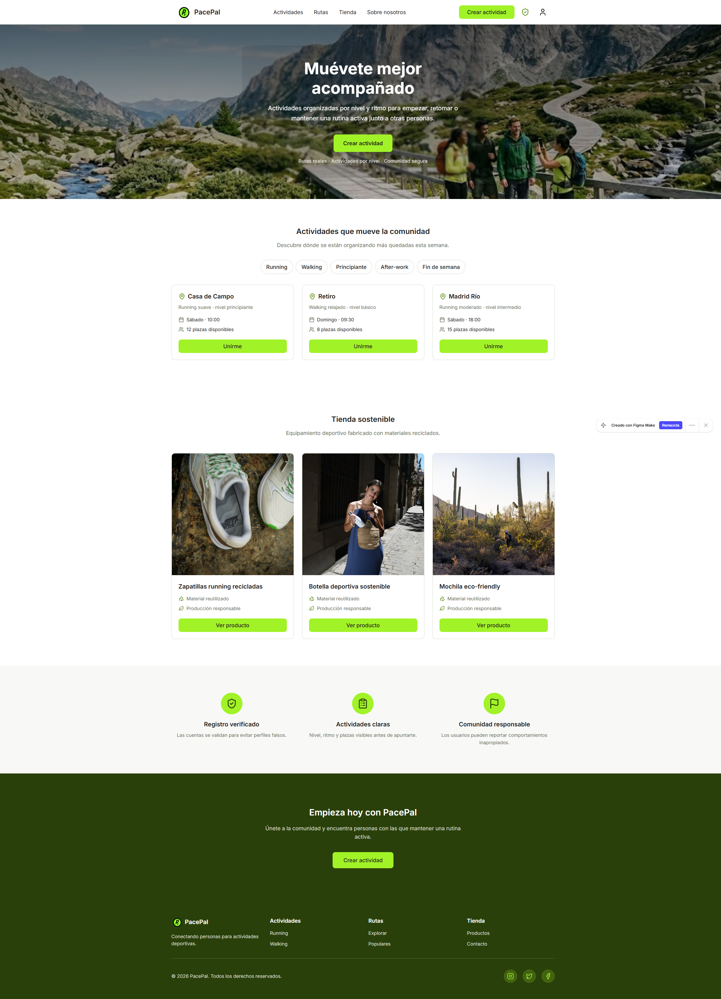
**Pie:** Wireframe de la landing de PacePal en versión escritorio. Planificación previa a la implementación.

### Figura C6 — Wireframe landing — móvil

<a id="fig-c6-wireframe-landing-mobile"></a>

**Pie:** Wireframe de la landing en versión móvil. Diseño responsive planificado.

### Figura C7 — Wireframe tienda — escritorio

<a id="fig-c7-wireframe-tienda"></a>
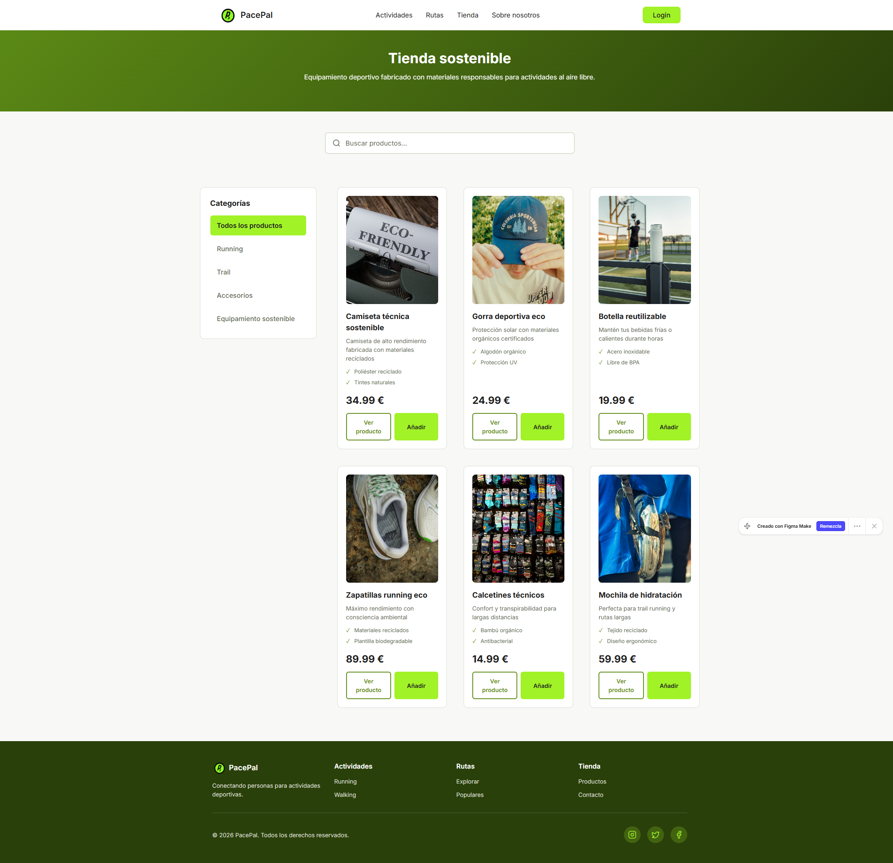
**Pie:** Wireframe de la tienda en escritorio.

### Figura C8 — Esquema responsive modular

<a id="fig-c8-responsive-modular"></a>

**Pie:** Sistema CSS modular y responsive de PacePal: variables, secciones y breakpoints.

### Figura C9a — Captura responsive desktop (1280×900)

<a id="fig-c9a-responsive-desktop"></a>

**Pie:** Landing page en viewport 1280×900 (escritorio).

### Figura C9b — Captura responsive tablet (768×1024)

<a id="fig-c9b-responsive-tablet"></a>

**Pie:** Landing page en viewport 768×1024 (tablet).

### Figura C9c — Captura responsive mobile (390×844)

<a id="fig-c9c-responsive-mobile"></a>

**Pie:** Landing page en viewport 390×844 (móvil).
```

> **Nota:** Los 15 wireframes restantes (actividades, rutas, about, admin, producto) también van en este Anexo C, usando el mismo patrón. No se listan aquí para no repetir contenido ya en el inventario.

---

### Anexo D — Funcionalidades React / DWEC

```markdown
## Anexo D — Funcionalidades React y JavaScript / DWEC

### Figura D1 — Tienda con buscador activo

<a id="fig-d1-tienda-buscador"></a>
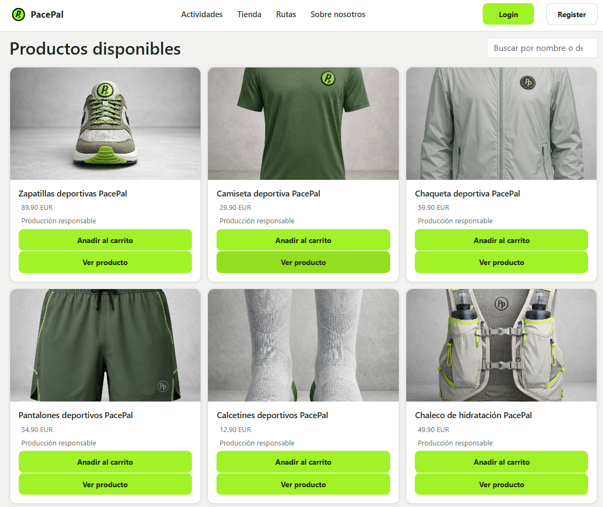
**Pie:** Tienda React con buscador activo y usuario logueado. Muestra resultados filtrados por término "zapatillas".

### Figura D2 — Buscador sin resultados

<a id="fig-d2-buscador-sin-resultados"></a>
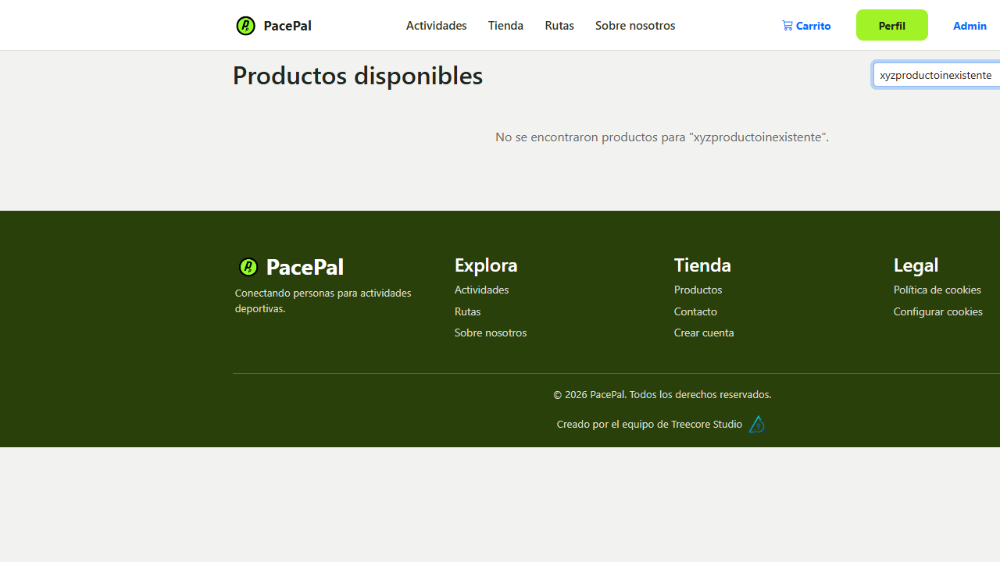
**Pie:** Buscador con término sin resultados. Mensaje de retroalimentación visible al usuario.

### Figura D3 — Detalle de producto

<a id="fig-d3-detalle-producto"></a>

**Pie:** Vista de detalle de producto en React (Zapatillas deportivas). Imagen, nombre, precio y descripción.

### Figura D4 — Carrito React con producto y total

<a id="fig-d4-carrito"></a>
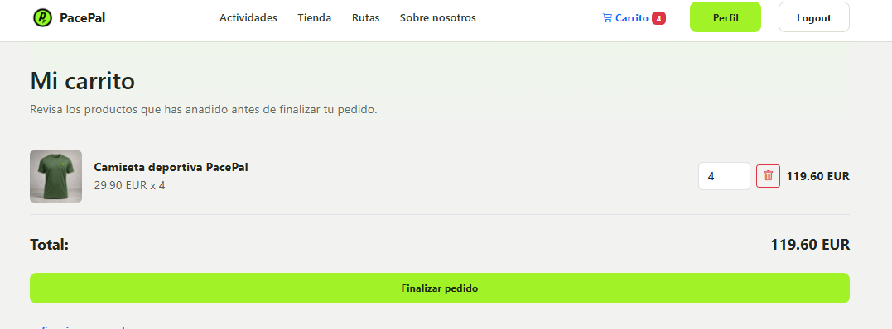
**Pie:** Carrito de compra React con producto añadido (Camiseta deportiva), cantidad 4 y total 119,60 EUR.

### Figura D5 — Confirmación de añadir al carrito

<a id="fig-d5-anadir-carrito"></a>
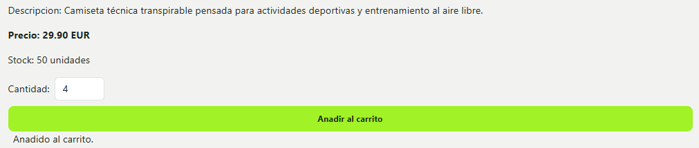
**Pie:** Mensaje de confirmación "Añadido al carrito." tras la acción del usuario en la tienda React.

### Figura D6 — Formulario de login React

<a id="fig-d6-login"></a>

**Pie:** Formulario de inicio de sesión en la versión React de PacePal.

### Figura D7 — Flujo de autenticación (login, sesión, logout)

<a id="fig-d7-flujo-auth"></a>

**Pie:** Diagrama del flujo completo de autenticación: login, gestión de sesión y logout.

### Figura D7a — Registro correcto (sprint 1)

<a id="fig-d7a-registro"></a>
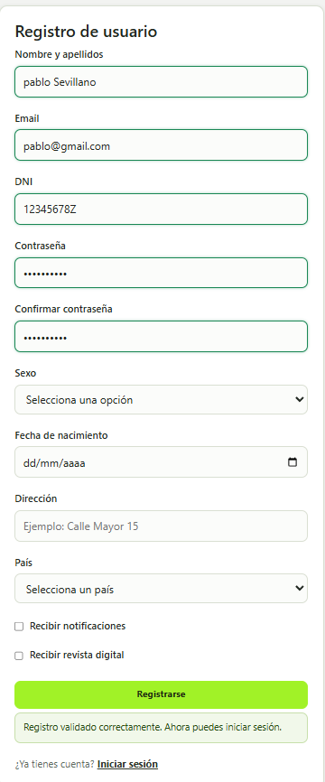
**Pie:** Registro de usuario exitoso con mensaje de confirmación.

### Figura D7b — Validación en vivo del formulario

<a id="fig-d7b-validacion"></a>
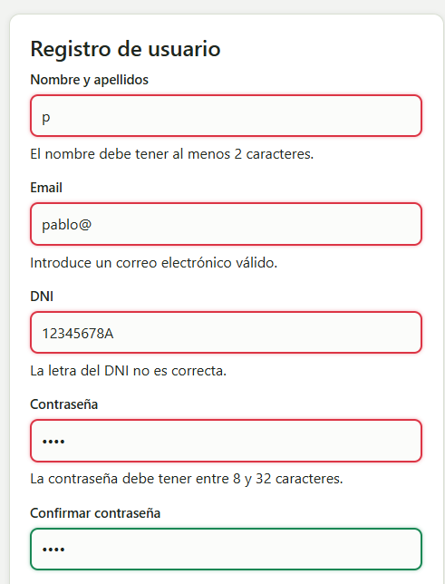
**Pie:** Validación en tiempo real del formulario de registro mientras el usuario escribe.

### Figura D8 — Perfil de usuario admin con historial

<a id="fig-d8-perfil"></a>

**Pie:** Perfil del usuario administrador con historial de pedidos. Confirma el funcionamiento del carrito en sesiones reales.

### Figura D9 — Panel de administración

<a id="fig-d9-panel-admin"></a>

**Pie:** Panel de administración de PacePal con opciones de gestión de usuarios y reportes.

### Figura D9b — Panel admin con datos de usuarios

<a id="fig-d9b-nuevos-usuarios"></a>
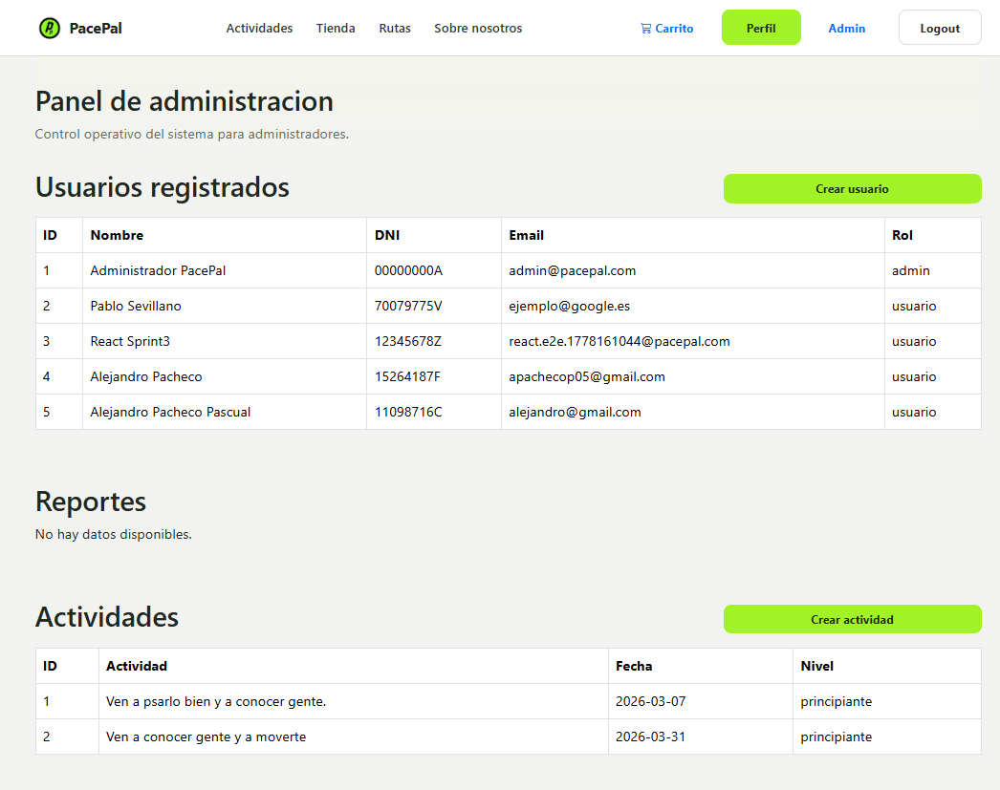
**Pie:** Vista del panel admin mostrando listado de nuevos usuarios registrados.

### Figura D10 — Flujo del buscador AJAX

<a id="fig-d10-flujo-buscador"></a>

**Pie:** Diagrama del flujo AJAX del buscador: entrada de usuario, petición a la API y renderizado de resultados.

### Figura D11 — Flujo del carrito

<a id="fig-d11-flujo-carrito"></a>

**Pie:** Diagrama del flujo de gestión del carrito en React.

### Figura D12 — Paginación de productos

<a id="fig-d12-paginacion"></a>
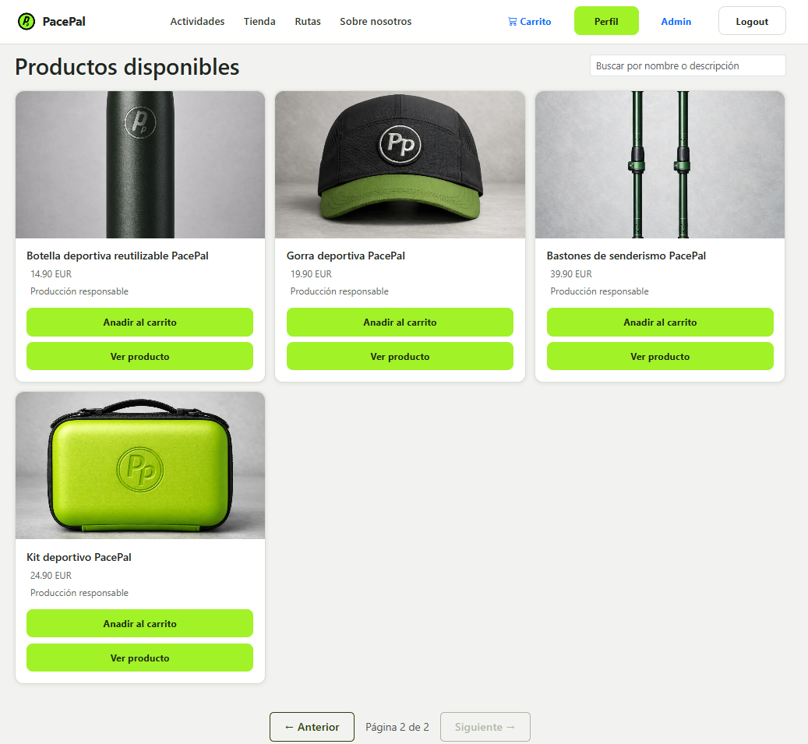
**Pie:** Segunda página de productos — demuestra el funcionamiento de la paginación en la tienda React.

### Figura D13 — Regresión de cookies y preferencias

<a id="fig-d13-cookies"></a>
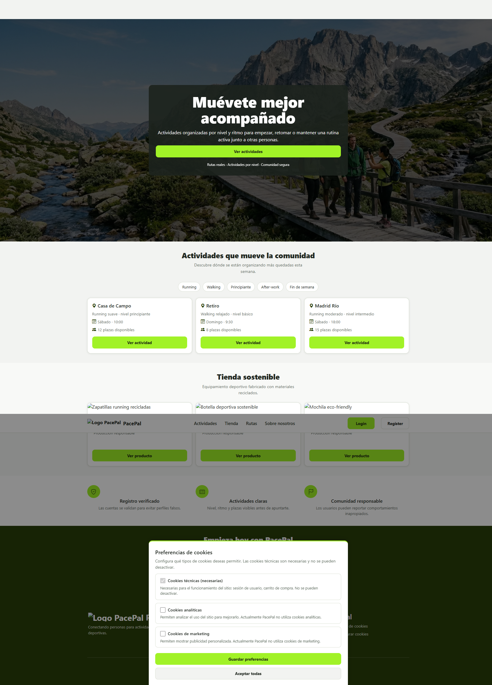
**Pie:** Evidencia de test de regresión: cookies de preferencias funcionando correctamente.
```

---

### Anexo E — Backend, API REST y base de datos / DWES

```markdown
## Anexo E — Backend, API REST y base de datos / DWES

### Figura E1 — API directa desde navegador — GET /api/productos

<a id="fig-e1-api-productos"></a>

**Pie:** Respuesta JSON de la API REST (GET /api/productos) visualizada directamente desde el navegador. No es Postman.

### Figura E2 — API directa desde navegador — GET /api/health

<a id="fig-e2-api-health"></a>

**Pie:** Endpoint de health de la API confirmando conexión correcta con la base de datos.

### Figura E3 — API directa desde navegador — GET /api/session

<a id="fig-e3-api-session"></a>

**Pie:** Respuesta de la API de sesión mostrando usuario admin autenticado.

### Figura E4 — Postman real — ejecución 1

<a id="fig-e4-postman-1"></a>

**Pie:** Ejecución de la colección Postman de PacePal. Resultados de GET /api/productos y errores 403/401 en endpoints protegidos.

### Figura E5 — Postman real — ejecución 2

<a id="fig-e5-postman-2"></a>

**Pie:** Segunda ejecución de la colección Postman de PacePal.

### Figura E6 — phpMyAdmin con base de datos PacePal

<a id="fig-e6-phpmyadmin"></a>

**Pie:** Base de datos PacePal en phpMyAdmin con 9 tablas, 5 usuarios y 38 filas de datos.
```

---

### Anexo F — Accesibilidad, usabilidad y multimedia

```markdown
## Anexo F — Accesibilidad, usabilidad y multimedia

### Figura F1 — Resultado Lighthouse — Accesibilidad 100

<a id="fig-f1-lighthouse"></a>

**Pie:** Resultado de Google Lighthouse: Accesibilidad 100, SEO 100, Rendimiento 96, Prácticas 100.

### Figura F2 — Análisis WAVE

<a id="fig-f2-wave"></a>

**Pie:** Análisis de accesibilidad realizado con WAVE (WebAIM). Sin errores de accesibilidad principales.

### Figura F3 — Verificación de contraste WCAG

<a id="fig-f3-contraste"></a>

**Pie:** Verificación del ratio de contraste entre color de texto y fondo. Cumplimiento WCAG AA/AAA.

### Figura F4 — Foco visible por teclado

<a id="fig-f4-foco-teclado"></a>

**Pie:** Foco visible (outline) al navegar con la tecla Tab por los elementos del header de PacePal.

### Figura F5 — Vídeo integrado en la tienda

<a id="fig-f5-video"></a>

**Pie:** Elemento `<video controls>` integrado en la sección de tienda. Reproductor con barra de tiempo visible (0:00/0:08).

### Figura F6 — Audio integrado [PENDIENTE]

<a id="fig-f6-audio"></a>

> **Esta figura está pendiente de captura manual.**  
> El archivo de audio existe (`img/audio/pacepal-contacto.mp3`), pero no se ha localizado visualmente el elemento `<audio controls>` en ninguna captura existente.  
> Acción: Abrir `pages/formulario/ContactPage.jsx` en el navegador y hacer screenshot de la sección con los controles de audio.

### Figura F7 — Botón de accesibilidad por voz [PENDIENTE]

<a id="fig-f7-voz"></a>

> **Esta figura está pendiente de captura manual.**  
> La funcionalidad de ayuda por voz está implementada en el código JavaScript. No existe una captura estática que muestre el botón de voz activado con feedback visual.  
> Texto recomendado para la memoria: "Funcionalidad implementada en código. Evidencia visual de activación pendiente de captura manual."
```

---

### Anexo G — Despliegue y evidencias técnicas

```markdown
## Anexo G — Despliegue y evidencias técnicas

### Figura G1 — Panel XAMPP activo

<a id="fig-g1-xampp"></a>

**Pie:** Panel de control de XAMPP con Apache y MySQL activos. Entorno de desarrollo local validado.

### Figura G2 — Aplicación PacePal en localhost

<a id="fig-g2-localhost"></a>

**Pie:** Aplicación PacePal accesible en http://localhost con XAMPP activo. Versión final del sprint 3.

### Figura G3 — GitHub Pages publicado con HTTPS

<a id="fig-g3-github-pages"></a>

**Pie:** Cliente React de PacePal publicado en GitHub Pages con protocolo HTTPS activo.

### Figura G4 — DevTools Console [PENDIENTE]

<a id="fig-g4-devtools-console"></a>

> **Esta figura está pendiente de captura manual.**  
> Cómo obtenerla: Chrome > F12 > Console > cargar app > screenshot sin errores críticos.

### Figura G5 — DevTools Network [PENDIENTE]

<a id="fig-g5-devtools-network"></a>

> **Esta figura está pendiente de captura manual.**  
> Cómo obtenerla: Chrome > F12 > Network > cargar tienda > click en GET /api/productos > ver respuesta JSON 200.
```

---

## 9. Referencias internas recomendadas para el cuerpo de la memoria

Estas frases están listas para pegar en el cuerpo de la memoria. Solo se usan las 15 figuras de la tabla "Figuras citables desde el cuerpo principal" (§2 de este documento).

### §3 — Planificación y recursos

```markdown
La evolución del proyecto por sprints se puede consultar en
[Figura A1: Diagrama de Gantt](#fig-a1-diagrama-de-gantt).
```

### §4.1 — Requisitos y análisis

```markdown
Los actores del sistema y sus principales casos de uso se representan en
[Figura A2: Diagrama de casos de uso](#fig-a2-casos-de-uso).

El modelo relacional de la base de datos se muestra en
[Figura B3: Modelo relacional simplificado](#fig-b3-modelo-relacional).
```

### §4.2 — Análisis y arquitectura

```markdown
La separación entre cliente React, API PHP y base de datos MySQL se muestra en
[Figura B2: Esquema de arquitectura general](#fig-b2-arquitectura).

La jerarquía de componentes React del cliente se detalla en
[Figura B1: Diagrama de componentes](#fig-b1-componentes).
```

### §4.3 — Diseño de interfaces

```markdown
La identidad visual del proyecto, incluyendo el logotipo, se documenta en
[Figura C1: Logotipo de PacePal](#fig-c1-logo) y
[Figura C2: Paleta de color corporativa](#fig-c2-paleta).

El diseño de la página principal fue planificado mediante wireframes, como se muestra en
[Figura C5: Wireframe landing escritorio](#fig-c5-wireframe-landing-desktop) y
[Figura C6: Wireframe landing móvil](#fig-c6-wireframe-landing-mobile).

El sistema CSS modular que permite el diseño responsive se esquematiza en
[Figura C8: Esquema responsive modular](#fig-c8-responsive-modular).
```

### §5.1 — Pruebas funcionales / DWEC

```markdown
El flujo de autenticación (login, gestión de sesión y logout) se puede consultar en
[Figura D7: Flujo de autenticación](#fig-d7-flujo-auth).

El carrito de compra React funcionando con producto real, precio y total se muestra en
[Figura D4: Carrito React con producto](#fig-d4-carrito) y la confirmación de añadir en
[Figura D5: Confirmación de añadir al carrito](#fig-d5-anadir-carrito).

Las evidencias visuales completas de las funcionalidades React (tienda, buscador, perfil, admin) se recogen en el **Anexo D**.
```

### §5.2 — Accesibilidad

```markdown
La auditoría de accesibilidad se realizó con Lighthouse, obteniendo una puntuación de 100 en accesibilidad
(ver [Figura F1: Resultado Lighthouse](#fig-f1-lighthouse)).

Las evidencias adicionales de contraste WCAG y análisis WAVE se recogen en el **Anexo F**.
```

### §5.1 / §9.2 — Despliegue

```markdown
El entorno de despliegue local fue validado con XAMPP activo
(ver [Figura G1: Panel XAMPP activo](#fig-g1-xampp)).

El cliente React fue publicado en GitHub Pages con HTTPS
(ver [Figura G3: GitHub Pages con HTTPS](#fig-g3-github-pages)).
```

### §9 — Pruebas y API (DWES)

```markdown
Las pruebas de la API REST fueron realizadas con Postman
(ver evidencias en **Anexo E**, Figuras E4 y E5).

Las respuestas de los endpoints principales de la API se verificaron directamente desde el navegador
(ver **Anexo E**, Figuras E1 a E3). Estas capturas muestran respuestas JSON reales desde el navegador,
no deben confundirse con capturas de Postman.
```

### §9.4 — Wireframes completos

```markdown
Los wireframes completos de todas las vistas del proyecto se encuentran en el **Anexo C**,
incluyendo versiones desktop y mobile de actividades, rutas, tienda, sobre nosotros y panel admin.
```

---

## 10. Nota sobre la carpeta `06-postman/` y la carpeta `07-consola/`

> **`capturas-finales/06-postman/`:** El nombre de la carpeta es histórico y se conserva. Las capturas concretas que contiene (`api-get-*.png`) muestran **respuestas JSON en el navegador**, no Postman. En la documentación, citar siempre como "API directa desde navegador". Las únicas capturas Postman reales del proyecto son `evidencias/dwes/postman1.png` y `postman2.png`.

> **`capturas-finales/07-consola/`:** El nombre de la carpeta es histórico y se conserva. Las capturas que contiene NO muestran DevTools Console ni DevTools Network. Muestran la **aplicación cargada en el navegador** o **respuestas API directas**. Para evidencias reales de DevTools, ver Pendientes Manuales PM-01 y PM-02.
