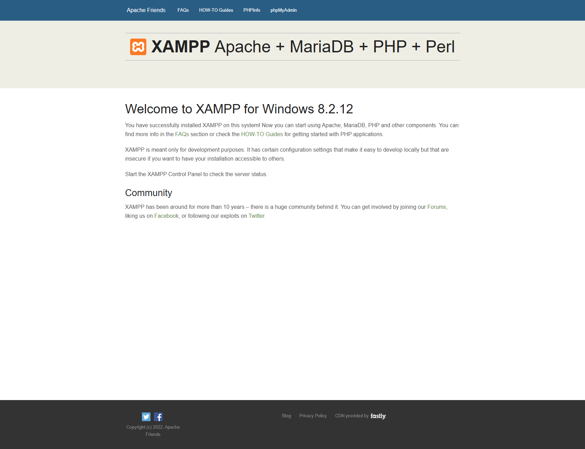
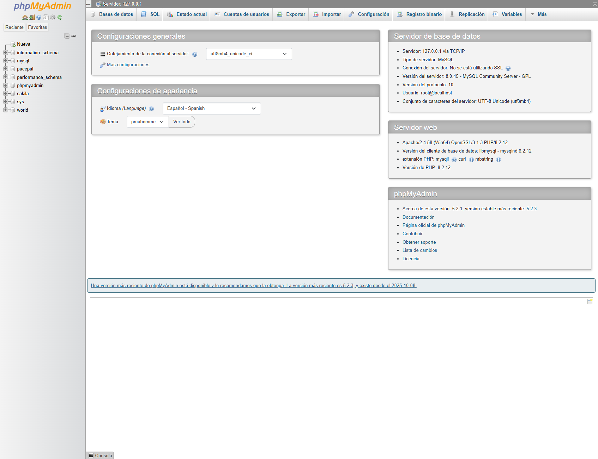
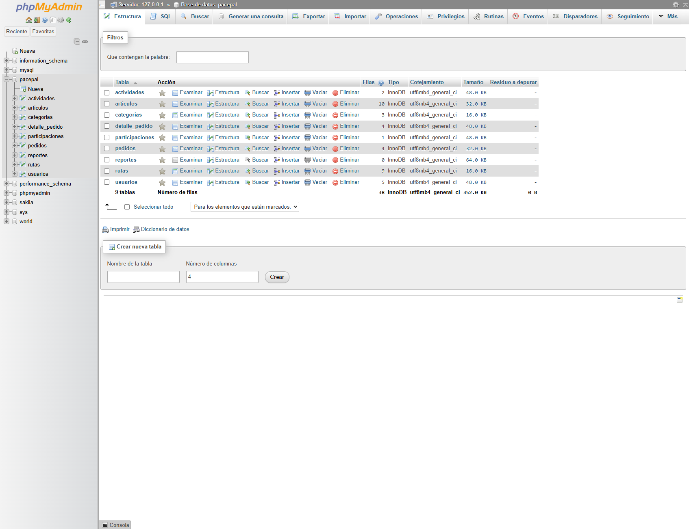
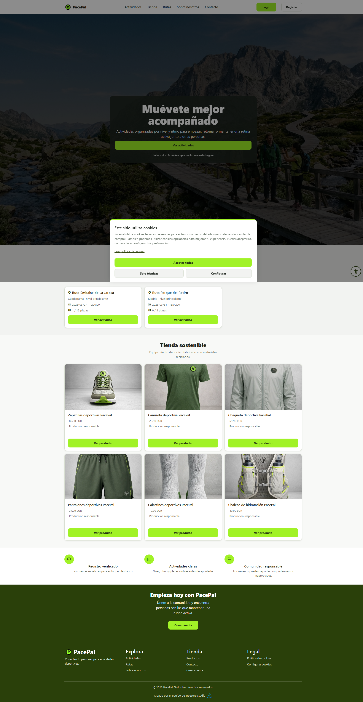
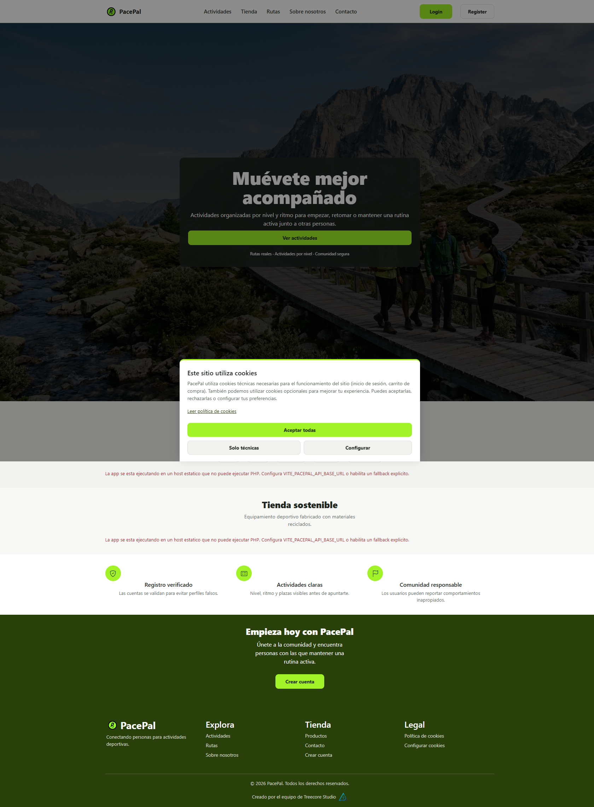

# Evidencias de despliegue Sprint 3

**Fecha de verificación:** 2026-05-11  
**Entorno:** Windows + XAMPP (`Apache` + `MariaDB`) en `localhost`

---

## Objetivo

Registrar evidencia local verificable para el despliegue en XAMPP, cumpliendo los requisitos de la rúbrica de despliegue:

- Arranque de Apache
- Disponibilidad de phpMyAdmin
- Base de datos `pacepal` importada/visible
- Acceso de la aplicación desde `localhost`
- Conectividad básica app/API
- Validación técnica de puertos y procesos
- Prueba de login y sesión activa (admin)
- Publicación HTTPS

---

## Inventario de evidencias

| Archivo | Evidencia | Requisito |
|---|---|---|
|  | Dashboard XAMPP accesible en `http://localhost/dashboard/` (servidor web operativo). | DEP-01, DEP-04 |
|  | phpMyAdmin accesible en `http://localhost/phpmyadmin/`. | DEP-02, DEP-04 |
|  | Estructura de la BD `pacepal` visible en phpMyAdmin. | DEP-02, DEP-06 |
|  | Aplicación cargando en `http://localhost/pacepalAgile/`. | DEP-03, DEP-04 |
|  | Endpoint local `/api/session` sin login (`{"logged":false}`). | DEP-03 |
|  | Endpoint local `/api/session` tras login admin (`{"logged":true, "rol":"admin"}`). | DEP-03 |
|  | Publicación visible en GitHub Pages por HTTPS. | DEP-07 |

### Evidencia técnica complementaria

| Archivo | Evidencia | Requisito |
|---|---|---|
| [06-netstat-puertos.txt](06-netstat-puertos.txt) | Puertos de servicio activos (incluye `:80` y `:3306`). | DEP-05 |
| [07-procesos-servicios.txt](07-procesos-servicios.txt) | Procesos `httpd.exe` y `mysqld.exe` activos. | DEP-01, DEP-05 |
| [09-https-headers-github-pages.txt](09-https-headers-github-pages.txt) | Cabeceras HTTPS de publicación pública (`200 OK`, `Strict-Transport-Security`). | DEP-07, DEP-08 |
| [10-ruta-proyecto-htdocs.txt](10-ruta-proyecto-htdocs.txt) | Ruta real del proyecto bajo `C:\xampp\htdocs` y validación de existencia. | DEP-06 |
| [11-permisos-proyecto-acl.txt](11-permisos-proyecto-acl.txt) | ACL/permisos del proyecto en el sistema de archivos. | DEP-06 |
| [12-healthcheck-localhost.txt](12-healthcheck-localhost.txt) | Healthcheck local de API (`/api/health`) con fecha de verificación. | DEP-03, DEP-08 |

---

## Trazabilidad por requisito

- **DEP-01:** `01-xampp-dashboard-localhost.png`, `07-procesos-servicios.txt`
- **DEP-02:** `02-phpmyadmin-home.png`, `03-phpmyadmin-bd-pacepal.png`
- **DEP-03:** `04-app-localhost-home.png`, `05-api-session-localhost.png`, `05-api-session-localhost-admin.png`
- **DEP-04:** `01-xampp-dashboard-localhost.png`, `04-app-localhost-home.png`
- **DEP-05:** `06-netstat-puertos.txt`, `07-procesos-servicios.txt`
- **DEP-06:** `03-phpmyadmin-bd-pacepal.png`, `10-ruta-proyecto-htdocs.txt`, `11-permisos-proyecto-acl.txt`
- **DEP-07:** `08-github-pages-publicacion-https.png`, `09-https-headers-github-pages.txt`
- **DEP-08:** `09-https-headers-github-pages.txt`, `12-healthcheck-localhost.txt`

---

## Evidencia de sesión activa como admin

- Endpoint: `/api/session`
- Resultado: `{ "logged": true, "usuario_id": 1, "rol": "admin" }`
- Usuario: admin@pacepal.com

Esta captura demuestra que el login de administrador funciona y la API reconoce la sesión activa correctamente.

---

**Cierre Sprint 3:**

Con estas evidencias, el bloque de despliegue de Sprint 3 queda documentado y trazado al 100% en su alcance local.

Informe de cierre: `docs/despliegue/RUBRICA_FINAL_CUMPLIMIENTO.md`